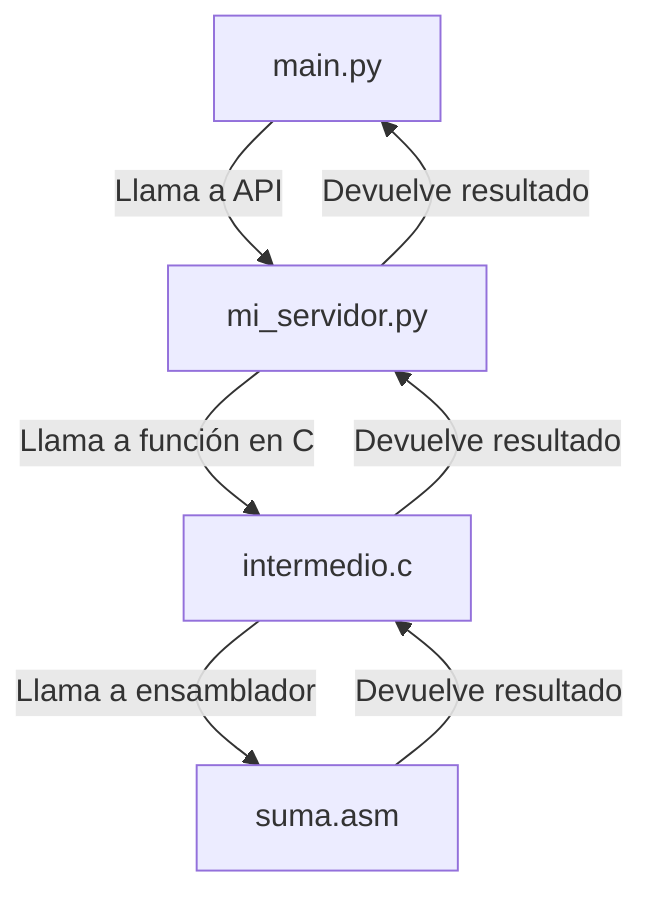

# Informe TP#2: Cálculos en Ensamblador y Consumo de API REST

**Integrantes del grupo:**

- Franco Cirrincione 
- Juan Pablo Sanchez Busso
- Leonardo Ariel Sánchez
-

**Fecha de entrega:** 21-04-2025

---

## 1. Introducción

Breve descripción del trabajo práctico y objetivos principales:

- Diseñar e implementar rutinas en ensamblador que realicen cálculos específicos (conversión de tipos y operación de índices).
- Consumir datos de una API REST (World Bank) desde Python.
- Pasar los datos obtenidos a un programa en C, que invocará rutinas en ensamblador mediante convenciones de llamada y uso del stack.
- Mostrar los resultados en la capa superior (C o Python).

## 2. Tecnologías y Herramientas

- **Lenguajes:** Python 3.13.3, C (gcc), Ensamblador x86 (NASM).
- **Depuración:** GDB, capturas del estado del stack.
- **Profiling:** `gprof -b` para medir rendimiento de implementación en C puro vs C + ensamblador.
- **Librerías Python:** `requests` para consumo de API.


## 3. Arquitectura de Capas

Describir la arquitectura de tres capas:

1. **Capa superior (Python/C):** Consulta a la API REST y presentación de resultados.
2. **Capa intermedia (C):** Recepción de datos, preparación de parámetros y llamada a rutinas en ensamblador.
3. **Capa inferior (Ensamblador):** Rutinas que realizan las conversiones y cálculos, usando el stack para pasar parámetros y devolver resultados.

## 4. Diseño

### 4.1 Diagrama de Bloques



### 4.2 Diagrama de Secuencia

```mermaid
sequenceDiagram
    participant Usuario
    participant main.py
    participant mi_servidor.py
    participant intermedio.c
    participant suma.asm

    Usuario->>main.py: Ejecuta script
    main.py->>mi_servidor.py: Llama a convertir_float_sv
    mi_servidor.py->>intermedio.c: Llama a función en C (convertir_float)
    intermedio.c->>suma.asm: Llama a función en ensamblador (suma_en_asm)
    suma.asm-->>intermedio.c: Devuelve resultado
    intermedio.c-->>mi_servidor.py: Devuelve resultado
    mi_servidor.py-->>main.py: Devuelve resultado
    main.py-->>Usuario: Muestra resultado
   ```

### 4.3 Uso del Stack


1. **Estado inicial en `main` (Breakpoint 1)**
   - **Stack Pointer (SP):** `0x7fffffffd900`.
   - **Dump de pila:** Muestra valores residuales (`nan` en `valor`, `4.59163468e-41` en `resultado`) antes de asignaciones, evidenciando memoria no inicializada.
   - **Observación:** Confirma que las variables locales (`valor` y `resultado`) no están inicializadas hasta la ejecución de las instrucciones posteriores, resaltando la importancia de inicializar antes de su uso.


2. **Entrada a `convertir_float` (Breakpoint 2)**
   - **SP:** `0x7fffffffd8e8` (desplazamiento de 0x18 bytes desde `main`).
   - **Argumento pasado:** En `x/16x $sp`, el valor `0x40b00000` corresponde a 5.5 en IEEE-754.
   - **Saved RIP:** Dirección de retorno `0x5555555517a` desde `convertir_float`.
   - **Observación:** Verifica que el parámetro float se pasa correctamente por la pila con convención cdecl, y permite correlacionar su representación binaria con el valor semántico.


3. **Dentro de `suma_en_c` (Breakpoint 3)**
   - **SP:** `0x7fffffffd8d8` (0x10 bytes más bajo que en `convertir_float`).
   - **Argumento en pila:** `5.5` recibido correctamente.
   - **Conexión de llamadas:** `convertir_float` invoca `suma_en_c`, demostrando anidamiento de llamadas y preservación de `ebp`.
   - **Observación:** El paso de un subnivel en C mantiene la convención de stack y permite verificar que la suma se realiza con el valor esperado.


4. **Retorno a `main` tras llamadas (Breakpoint 4)**
   - **SP restaurado:** Regresa a `0x7fffffffd900`, confirmando limpieza de la pila tras `ret`.
   - **Resultado final:** `resultado = 6.5`, que coincide con `5.5 + 1.0`.
   - **Observación:** Corrobora que las rutinas ensamblador y C trabajan correctamente en tándem y que el uso del stack sigue la convención esperada.


## 5. Implementación

### 5.1 Consumir API REST en Python

```python
import requests

def get_valor_api():
    # URL de la API del Banco Mundial para el índice GINI de Argentina (2011-2020)
    url = "https://api.worldbank.org/v2/en/country/ARG/indicator/SI.POV.GINI?format=json&date=2011:2020"
    
    try:
        response = requests.get(url)
        data = response.json()
        
        # La estructura de la respuesta es [metadata, datos]
        if len(data) >= 2 and data[1]:
            # Tomamos el valor más reciente disponible (último año con datos)
            for item in data[1]:
                if item['value'] is not None:
                    return float(item['value'])
            
        raise ValueError("No se encontraron datos válidos para el índice GINI de Argentina")
    
    except Exception as e:
        print(f"Error al obtener datos de la API: {e}")
        return 0.0  # Valor por defecto en caso de error
```

### 5.2 Programa en C

- Preparación de parámetros y llamada a la rutina ensamblador.

```c
extern float suma_en_asm(float valor);  

float convertir_float(float valor) {
    return suma_en_asm(valor);  
}
```

### 5.3 Rutina en Ensamblador (NASM)

```nasm
suma_en_asm:
    push ebp
    mov ebp, esp

    ; Cargar el parámetro float desde la pila
    fld dword [ebp+8]      ; ST(0) = valor

    ; Cargar 1.0 en la FPU
    fld1                   ; ST(0) = 1.0, ST(1) = valor

    ; Sumar ST(0) + ST(1) → ST(1)
    faddp st1, st0         ; ST(0) = resultado

    ; Retornar el float por ST(0)
    pop ebp
    ret
```

## 6. Prueba de Funcionamiento

Ejecutamos el programa de Python junto con la implementación en C, recordemos que la salida es el indice GINI de Argentina, en primer lugar. En segundo lugar, este valor esta procesado, se le ha sumado uno y se lo convierte en entero.


Observamos la salida del programa que implementa Python, C y Assembler. Se observa el valor retornado por la API, luego vemos el valor procesado, donde se le ha sumado uno. Y por ultimo, de forma ilustrativa, la diferencia de ambos.


## 7. Profiling y Resultados de Rendimiento

Comparativa con `gprof -b`:

- **Implementación en C puro:**
  

- **C + Ensamblador:**


## 8. Conclusiones

- La integración de Python, C y ensamblador evidencia la interoperabilidad de capas.
- El uso de convenciones de llamada y el stack es esencial para el enlace entre lenguajes.
- Posibles mejoras:
  - Manejo de errores y validaciones más robustas.
  - Extender la API a otros indicadores.


---


