# SdeC_StackFrame
Se desarrolla en el siguiente repositorio, el practico #2 de Sistemas de Computación


## Diagramas

### Diagrama de bloques

```mermaid
graph TD
    A[main.py] -->|Llama a API| B[mi_servidor.py]
    B -->|Llama a función en C| C[intermedio.c]
    C -->|Llama a ensamblador| D[suma.asm]
    D -->|Devuelve resultado| C
    C -->|Devuelve resultado| B
    B -->|Devuelve resultado| A

```

### Diagrama de secuencia
```mermaid
sequenceDiagram
    participant Usuario
    participant main.py
    participant mi_servidor.py
    participant intermedio.c
    participant suma.asm

    Usuario->>main.py: Ejecuta script
    main.py->>mi_servidor.py: Llama a convertir_float_sv
    mi_servidor.py->>intermedio.c: Llama a función en C (convertir_float)
    intermedio.c->>suma.asm: Llama a función en ensamblador (suma_en_asm)
    suma.asm-->>intermedio.c: Devuelve resultado
    intermedio.c-->>mi_servidor.py: Devuelve resultado
    mi_servidor.py-->>main.py: Devuelve resultado
    main.py-->>Usuario: Muestra resultado
   ```

## Depuracion

### Verificacion del stack con gdb


----

### Profiling
Profiling del programa sin asm:


----

Profiling del programa con asm:


